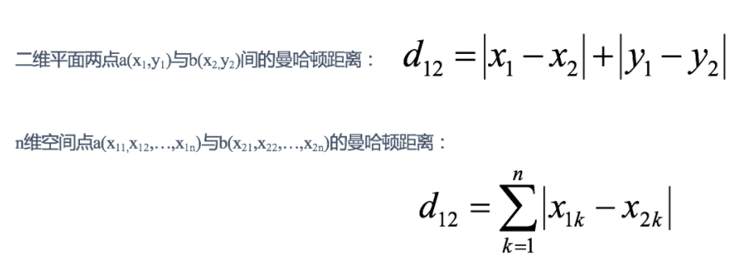
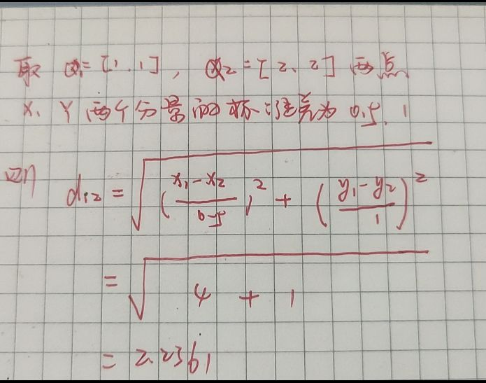

# Distance（距离）

## 1、欧式距离

> 其实就是我们常见的欧式距离，可以理解为根据坐标求距离，常见的就是平面的公式，依次也可以推出三维和多维的距离公式。


## 2 **曼哈顿距离(Manhattan Distance)：**

> 在曼哈顿街区要从一个十字路口开车到另一个十字路口，驾驶距离显然不是两点间的直线距离。这个实际驾驶距离就是“曼哈顿距离”。曼哈顿距离也称为“城市街区距离”(City Block distance)。

通俗的来讲曼哈顿距离就是两点的X距离+Y的距离，那么也可以推到多维的空间去



## 3 切比雪夫距离 (Chebyshev Distance)：

> 国际象棋中，国王可以直行、横行、斜行，所以国王走一步可以移动到相邻8个方格中的任意一个。国王从格子(x1,y1)走到格子(x2,y2)最少需要多少步？这个距离就叫切比雪夫距离。

切比雪夫距离其实跟欧式距离有一点类似，只不过切比雪夫可以斜着走，那也就是说，切比雪夫可以同时X轴和Y轴同时加1，其实也就是求一个某一个轴最大的距离即可。


## 4 闵可夫斯基距离(Minkowski Distance)：

闵氏距离不是一种距离，而是一组距离的定义，是对多个距离度量公式的概括性的表述。

两个n维变量a(x11,x12,…,x1n)与b(x21,x22,…,x2n)间的闵可夫斯基距离定义为：


其中p是一个变参数：

当p=1时，就是曼哈顿距离；

当p=2时，就是欧氏距离；

当p→∞时，就是切比雪夫距离。

根据p的不同，闵氏距离可以表示某一类/种的距离。

#### 以上几种距离的缺点：

**(1)将各个分量的量纲(scale)，也就是“单位”相同的看待了;**

 **(2)未考虑各个分量的分布（期望，方差等）可能是不同的。**

比如：身高和体重不可相同看待

## 5 标准化欧氏距离 (Standardized EuclideanDistance)：

> 标准化欧氏距离是针对欧氏距离的缺点而作的一种改进。思路：既然数据各维分量的分布不一样，那先将各个分量都“标准化”到均值、方差相等。假设样本集X的均值(mean)为m，标准差(standard deviation)为s，X的“标准化变量”表示为


> ```
> X=[[1,1],[2,2],[3,3],[4,4]];（假设两个分量的标准差分别为0.5和1）
> 经计算得:
> d =   2.2361    4.4721    6.7082    2.2361    4.4721    2.2361
> ```

这个可能不好计算，我在这里手写计算一下，并声明，这里的标准差0.5和1是为了计算方便在这里假设的



## 6 余弦距离(Cosine Distance)


余弦值得求法可以参考高数里面的资料。

夹角余弦取值范围为[-1,1]。余弦越大表示两个向量的夹角越小，余弦越小表示两向量的夹角越大。当两个向量的方向重合时余弦取最大值1，当两个向量的方向完全相反余弦取最小值-1。

## 7 汉明距离(Hamming Distance)

> 两个等长字符串s1与s2的汉明距离为：将其中一个变为另外一个所需要作的最小字符替换次数。

**汉明重量**：是字符串相对于同样长度的零字符串的汉明距离，也就是说，它是字符串中非零的元素个数：对于二进制字符串来说，就是 1 的个数，所以 11101 的汉明重量是 4。因此，如果向量空间中的元素a和b之间的汉明距离等于它们汉明重量的差a-b。

```
 1011101与 1001001 的汉明距离　
```

## **8 杰卡德距离(Jaccard Distance)**

>  杰卡德相似系数(Jaccard similarity coefficient)：两个集合A和B的交集元素在A，B的并集中所占的比例，称为两个集合的杰卡德相似系数，用符号J(A,B)表示：

杰卡德距离(Jaccard Distance)：与杰卡德相似系数相反，用两个集合中不同元素占所有元素的比例来衡量两个集合的区分度：


```python
X=[[1,1,0][1,-1,0],[-1,1,0]]
注：以下计算中，把杰卡德距离定义为不同的维度的个数占“非全零维度”的比例
经计算得:
d =   0.5000    0.5000    1.0000
例如第一个0.5的计算规则：
[1,1,0][1,-1,0]两个点，z是都为0，那么久不统计，而前面的x、y只有x相同，也就是有1个有不相同，也就是1/2 = 0.5

```

## 9 马氏距离(Mahalanobis Distance)

下图有两个正态分布图，它们的均值分别为a和b，但方差不一样，则图中的A点离哪个总体更近？或者说A有更大的概率属于谁？其实马氏距离是一个正态分布的模型，了解下即可。